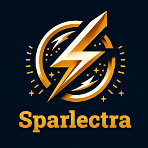

[](https://welthulk.github.io/Sparlectra.jl/)


# SPARLECTRA
<a href="https://github.com/Welthulk/Sparlectra.jl/tree/main/"></a>

This package contains tools for subsequent network calculations. It primarily features programs for calculating load flow and state estimation. The focus is to provide valuable insights into power-system calculations for both students and ambitious professionals.

---

## Features

- AC power flow with rectangular complex-state Newton-Raphson as default (`:rectangular`); legacy `:polar_full` / `:classic` are deprecated.
- State Estimation (WLS) as an **experimental** feature
- Canonical external solver interface (`PFModel`/`PFSolution`) to integrate third-party solvers.
- PV-to-PQ bus switching.
- MATPOWER-compatible import/export utilities and local casefile helper workflow.
- Loss calculations and power flow results reporting.
- Network Modeling: 
    - Buses with prosumer-derived PF typing (PQ, PV, Slack)
    - Transmission lines
    - Transformers (2-winding and 3-winding)
    - Generators and loads
    - Shunts
    - Topological impedanceless bus links (`addLink!`) 
- Transmission lines and transformers can be represented using π-equivalent models,
allowing direct use of CIM and manufacturer data without additional model conversions.    

---

## Installation

For installation, run the following command in the Julia REPL:
```julia
using Pkg
Pkg.add("Sparlectra")
```

## Quick Start

Here's a simple example to get you started:

```julia
using Sparlectra

# Ensure case file exists locally (downloads on demand into data/mpower)
case_path = ensure_casefile("case14.m")

# Build network and run AC power flow (including post-processing)
net = createNetFromMatPowerFile(case_path, false)
ite, erg = run_net_acpflow(net; iter_max = 10, tol = 1e-6, print = 0)

if erg == 0
    printACPFlowResults(net, 0.0, ite, 1e-6)
end
```

## Documentation Structure

- **[Changelog](docs/src/changelog.md)**: Version history and updates
- **[Networks](docs/src/networks.md)**: Creating and manipulating network models
- **[Branch Model](docs/src/branchmodel.md)**: Details of the network branch model
- **[Import/Export](docs/src/import.md)**: Importing and exporting network configurations
- **[Component Removal](docs/src/remove_functions.md)**: Conceptual notes on topology-aware removal workflows
- **[Workshop](docs/src/workshop.md)**: Guided exercises and examples
- **[State Estimation](docs/src/state_estimation.md)**: Theory, observability, and practical SE workflow
- **[Network Reports](docs/src/netreports.md)**: Create and use machine-readable `ACPFlowReport` output
- **[Function Reference](docs/src/reference.md)**: Complete API documentation
- **[Powerlimit Guide](docs/src/powerlimits.md)**: Handling of power limits
- **[Solver Guide](docs/src/solver.md)**: Numerical solver formulations and FD Jacobians


### Network Creation
This package supports the import and export of Matpower .m files, although currently it only reads bus, generator, and branch data from these files. Please note that additional Matlab functions within the .m file are not supported. Additionally, you can modify the imported Matpower files or you can create your own network using easy-to-use functions provided by the package.

### Bus typing in power flow

`addBus!` defines the electrical node data (`busName`, `vn_kV`, optional `vm_pu`, `va_deg`).
The operational PF bus type is resolved from attached prosumers:

- Slack: at least one slack-defining prosumer (`referencePri` set, e.g. `EXTERNALNETWORKINJECTION`).
- PV: at least one regulating generator prosumer (`isRegulated = true`, or controller metadata, or generator with `vm_pu` setpoint).
- PQ: default fallback (loads only, non-regulating generation, or mixed non-regulating injections).

The legacy `busType` argument in `addBus!` is still accepted for compatibility, but ignored for PF typing.

### Release status of State Estimation

The current State Estimation functionality should be considered **experimental**.
The present implementation provides a first nonlinear WLS workflow with
observability helpers, convenient measurement-building utilities, and support
for passive buses via zero-injection pseudo measurements. At the moment,
zero-injection buses are modeled through pseudo measurements with small
variances rather than a dedicated hard-constraint block, and bad-data detection
is not yet exposed as a full public API. The current scripts and result fields
support residual inspection, but a dedicated diagnostics workflow remains part
of the roadmap.

### Test Cases and Benchmarks

Sparlectra does not ship third-party power system test cases by default.

Instead, MATPOWER-compatible case files (e.g. `case14`, `case118`) can be
downloaded **on demand** using helper scripts provided with the package.
Downloaded files are stored locally and are not part of the Sparlectra source
distribution.

This approach keeps the repository lightweight and avoids bundling external
data while still allowing reproducible experiments and benchmarks.


### License
This project is licensed under the Apache License, Version 2.0.
[The license file](https://github.com/welthulk/Sparlectra.jl/blob/main/LICENSE) contains the complete licensing information.

### Note for publications
If you use Sparlectra in publications, presentations, or project reports, a brief
mention is appreciated: the program name **Sparlectra.jl**, the GitHub repository
link (<https://github.com/Welthulk/Sparlectra.jl>), and the original author
**Udo Schmitz**.


