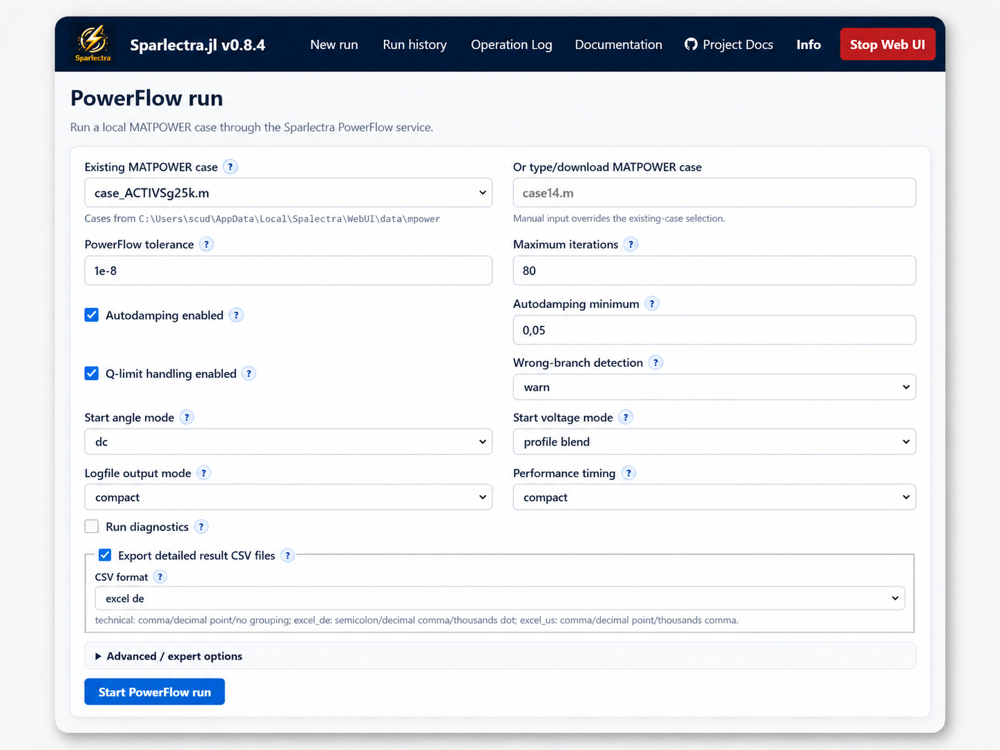

# Sparlectra.jl

[](https://welthulk.github.io/Sparlectra.jl/)
[](https://github.com/Welthulk/Sparlectra.jl/blob/main/Project.toml)
[](LICENSE)
[](https://julialang.org/)

**Sparlectra.jl is a Julia package for transparent power-system calculations.**

<a href="https://github.com/Welthulk/Sparlectra.jl/tree/main/"></a>

Sparlectra focuses on understandable and inspectable algorithms for AC power flow, PV/PQ switching, MATPOWER-based studies, transformer-control experiments, and experimental weighted-least-squares state estimation.

It is intended for engineers, researchers, and students who want to understand, test, and extend power-flow and state-estimation algorithms without hiding the numerical core behind a black box.

---

## Why Sparlectra?

| Need | Sparlectra focus |
|---|---|
| Understand Newton-Raphson power-flow internals | Transparent rectangular complex-state formulation |
| Study PV/PQ switching | Explicit Q-limit and active-set diagnostics |
| Work with MATPOWER cases | Import helpers, local casefile workflow, and comparison diagnostics |
| Teach or inspect power-system algorithms | Readable Julia implementation with direct model access |
| Experiment with state estimation | Experimental nonlinear WLS workflow |
| Integrate external solvers | `PFModel` / `PFSolution` interface |
| Investigate voltage-control behavior | Transformer tap and voltage-control experiments |

Sparlectra is not primarily an optimization framework; it focuses on solver mechanics, model transparency, diagnostics, and engineering-oriented experimentation.

---

## Main features

- Rectangular complex-state Newton-Raphson AC power flow.
- Sparse-matrix-oriented implementation for realistic network studies.
- PV/PQ bus handling with Q-limit checks and active-set diagnostics.
- MATPOWER-compatible case import and comparison diagnostics.
- Network modeling for buses, lines, transformers, generators, loads, shunts, links, and π-equivalent branch models.
- Experimental nonlinear weighted-least-squares state estimation.
- Transformer tap and voltage-control experiments.
- Optional local Web UI for MATPOWER power-flow studies.

---

## Installation

Install Sparlectra from the Julia package manager:

```julia
using Pkg
Pkg.add("Sparlectra")
```

Then load it with:

```julia
using Sparlectra
```

---

## Quick start

`run_sparlectra` is the preferred public framework entry point. It owns MATPOWER import, configuration, optional control-loop execution, solving, post-processing, and configured output. For AC power-flow examples, `run_acpflow` is kept as a thin compatibility alias with the same minimal configuration-driven signature.

This example is runnable from a fresh checkout or package installation. The `ensure_casefile` helper downloads `case14.m` on demand if it is not already available locally.

```julia
using Sparlectra

case_path = ensure_casefile("case14.m")

result = run_sparlectra(
    casefile = basename(case_path),
    path = dirname(case_path),
)

println(result.outcome)
println(result.iterations)
println(result.final_mismatch)
```

For custom network construction, batch execution, solver internals, and the local Web UI, see the documentation links below.

---

## Local Web UI

[](https://welthulk.github.io/Sparlectra.jl/webui/)

Sparlectra includes an optional browser-based local Web UI for MATPOWER power-flow studies. See the [Local Web UI documentation](https://welthulk.github.io/Sparlectra.jl/webui/) for startup commands, configuration, run history, artifacts, and MATPOWER case handling.

---

## API entry points

| Layer | Function | Purpose |
|---|---|---|
| Framework | `run_sparlectra` (`run_acpflow` alias) | Import/config/control/solve/output orchestration for one run |
| Framework batch | `run_sparlectra_cases` | Sequential deterministic execution of configured `matpower_import.cases` |
| Solver | `runpf!` | Solve an already built `Net` using `PowerFlowConfig` |
| Control | `run_control!` | Execute outer-loop controllers |
| Import | `createNetFromMatPowerFile` | Convert a MATPOWER file into a `Net` without running the full framework workflow |

---

## Documentation

The full documentation is available here:

<https://welthulk.github.io/Sparlectra.jl/>

Useful entry points:

- [Local Web UI](https://welthulk.github.io/Sparlectra.jl/webui/) — browser-based local MATPOWER power-flow workflow
- [Changelog](docs/src/changelog.md) — version history and release notes
- [Networks](docs/src/networks.md) — creating and manipulating network models
- [Branch Model](docs/src/branchmodel.md) — line and transformer branch modeling
- [Import/Export](docs/src/import.md) — importing and exporting network data
- [Workshop](docs/src/workshop.md) — guided examples and exercises
- [State Estimation](docs/src/state_estimation.md) — WLS state-estimation workflow
- [Feature Matrix](docs/src/feature_matrix.md) — power-flow and state-estimation capability overview
- [Network Reports](docs/src/netreports.md) — machine-readable `ACPFlowReport` output
- [Solver Guide](docs/src/solver.md) — numerical solver formulations
- [Transformer Control](docs/src/transformer_control.md) — transformer tap and voltage-control behavior
- [Function Reference](docs/src/reference.md) — public API reference

---

## Who is this for?

Sparlectra may be useful if you are:

- learning AC power-flow and state-estimation methods,
- teaching Newton-Raphson power-flow mechanics,
- testing PV/PQ switching and Q-limit behavior,
- investigating MATPOWER import behavior,
- experimenting with transformer-control concepts,
- building your own solver and need a transparent reference workflow,
- interested in power-system algorithms implemented in Julia.

---

## Contributing

Contributions, bug reports, test cases, and documentation improvements are welcome.

Before contributing, please read:

- [CONTRIBUTING.md](CONTRIBUTING.md)
- [CODE_OF_CONDUCT.md](CODE_OF_CONDUCT.md)

Good first contributions include:

- improving examples,
- adding small reproducible test networks,
- extending documentation,
- reporting MATPOWER import edge cases,
- improving diagnostics and error messages.

---

## Citing Sparlectra

If you use Sparlectra.jl in teaching, research, presentations, or project reports, please cite the repository.

```bibtex
@software{sparlectra_jl,
  title  = {Sparlectra.jl: Transparent Power-Flow and State-Estimation Experiments in Julia},
  author = {Schmitz, Udo},
  year   = {2026},
  url    = {https://github.com/Welthulk/Sparlectra.jl}
}
```

---

## License

Sparlectra.jl is licensed under the Apache License, Version 2.0.

See [LICENSE](LICENSE) for the full license text.
