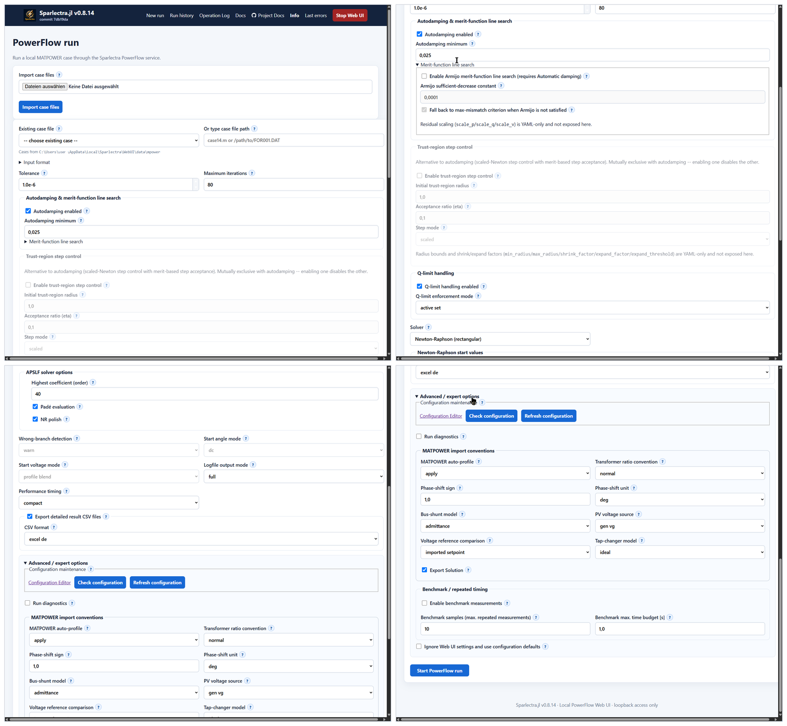
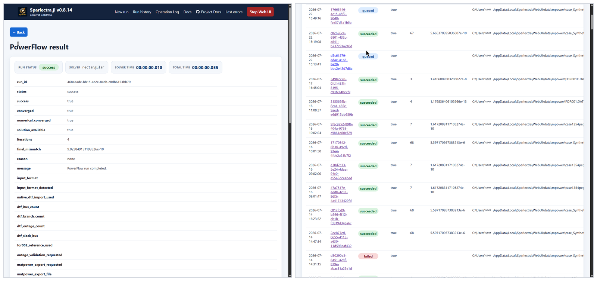

# Sparlectra.jl

[](https://welthulk.github.io/Sparlectra.jl/)
[](https://github.com/Welthulk/Sparlectra.jl/blob/main/Project.toml)
[](LICENSE)
[](https://julialang.org/)

**Sparlectra.jl is a Julia framework for transparent, inspectable power-system analysis.**

<a href="https://github.com/Welthulk/Sparlectra.jl/tree/main/"></a>

Sparlectra provides a full AC power-flow workflow — from Network import through solving to configurable reporting — built around a design principle that sets it apart from black-box tools: every stage of the numerical pipeline is open, documented, and directly accessible. Model construction, Jacobian assembly, PV/PQ active-set handling, and convergence behavior can all be inspected and instrumented at runtime. Two solver backends are available: the built-in rectangular Newton-Raphson solver, and an optional analytic power-series solver (APSLF, via the AnalyticLoadFlow.jl package extension) usable standalone, as the primary solver, or as a guarded start-value generator ahead of Newton-Raphson.

That transparency is not a research-only trade-off. Deterministic, configuration-driven runs, explicit Q-limit and AC-island handling, and machine-readable reporting make Sparlectra suitable for production grid studies and planning work, alongside algorithm development, solver benchmarking, and cross-validation.

---

## Why Sparlectra?

| Requirement | Sparlectra approach |
|---|---|
| Reproducible AC power-flow studies | Deterministic, configuration-driven framework runs |
| Insight into Newton-Raphson internals | Transparent rectangular complex-state formulation |
| Robust PV/PQ handling | Explicit Q-limit enforcement with active-set diagnostics |
| MATPOWER interoperability | Case import, local casefile workflow, comparison diagnostics |
| Custom solver integration | Clean `PFModel` / `PFSolution` interface for external solvers |
| Voltage- and tap-control studies | Outer-loop control framework for transformer regulation |
| Alternative solver backend | Optional analytic power-series solver (APSLF, via AnalyticLoadFlow.jl) — standalone, as the primary solver, or as an NR start-value generator |
| State estimation | Nonlinear weighted-least-squares workflow (experimental) |
| Scalability | Sparse-matrix-oriented implementation for realistic network sizes |

---

## Main features

- Rectangular complex-state Newton-Raphson AC power flow.
- Sparse-matrix-oriented implementation for realistic network studies.
- PV/PQ bus handling with Q-limit enforcement and active-set diagnostics.
- Comprehensive network modeling: buses, lines, transformers, generators, loads, shunts, links, and π-equivalent branch models.
- Outer-loop control framework for transformer tap and voltage control.
- Configuration-driven batch execution for systematic case studies.
- External-solver integration via the `PFModel` / `PFSolution` interface, including an optional analytic power-series solver (APSLF, via AnalyticLoadFlow.jl) usable standalone, as the primary solver, or as a Newton-Raphson start-value generator.
- Nonlinear weighted-least-squares state estimation (experimental).
- Machine-readable reporting (`ACPFlowReport`) and an optional local Web UI.

---

## Installation

```julia
using Pkg
Pkg.add("Sparlectra")
```

```julia
using Sparlectra
```

---

## Quick start

`run_sparlectra` is the primary framework entry point. It orchestrates MATPOWER import, configuration, optional control-loop execution, solving, post-processing, and configured output. For AC power-flow scripts, `run_acpflow` remains available as a thin compatibility alias with the same configuration-driven signature.

The example below runs from a fresh checkout or package installation; `ensure_casefile` downloads `case14.m` on demand if it is not present locally.

```julia
using Sparlectra

case_path = ensure_casefile("case14.m")

result = run_sparlectra(
    casefile = basename(case_path),
    path = dirname(case_path),
)

println(result.outcome)
println(result.iterations)
println(result.final_mismatch)
```

For custom network construction, batch execution, solver internals, and the local Web UI, see the documentation linked below.

---

## Local Web UI

Sparlectra ships with an optional browser-based local Web UI for MATPOWER power-flow studies, including run history, artifacts, and case management. See the [Web UI documentation](https://welthulk.github.io/Sparlectra.jl/webui/) for setup and configuration.

**Configuration** — case selection, solver settings, control options and output configuration on a single page:

<p align="center">
  <a href="docs/src/assets/webui_configuration.png"></a>
</p>

**Power flow run & history** — result with convergence report (left) and the run history (right):

<p align="center">
  <a href="docs/src/assets/webui_powerflow_history.png"></a>
</p>

---

## API entry points

| Layer | Function | Purpose |
|---|---|---|
| Framework | `run_sparlectra` (`run_acpflow` alias) | Import/config/control/solve/output orchestration for one run |
| Framework batch | `run_sparlectra_cases` | Sequential deterministic execution of configured `matpower_import.cases` |
| Solver | `runpf!` | Solve an already built `Net` using `PowerFlowConfig` |
| Alternative solver | `apslf_solver` | Reachability point for the APSLF (AnalyticLoadFlow.jl) external-solver backend |
| Control | `run_control!` | Execute outer-loop controllers |
| Import | `createNetFromMatPowerFile` | Convert a MATPOWER file into a `Net` without the full framework workflow |

---

## Documentation

Full documentation: <https://welthulk.github.io/Sparlectra.jl/>

Key entry points:

- [Local Web UI](https://welthulk.github.io/Sparlectra.jl/webui/) — browser-based local MATPOWER power-flow workflow
- [Changelog](docs/src/changelog.md) — version history and release notes
- [Networks](docs/src/networks.md) — building and manipulating network models
- [Branch Model](docs/src/branchmodel.md) — line and transformer branch modeling, tap and voltage control
- [Import/Export](docs/src/import.md) — importing and exporting network data
- [State Estimation](docs/src/state_estimation.md) — WLS state-estimation workflow
- [Feature Matrix](docs/src/feature_matrix.md) — power-flow and state-estimation capability overview
- [Network Reports](docs/src/netreports.md) — machine-readable `ACPFlowReport` output
- [Solver Guide](docs/src/solver.md) — numerical solver formulations
- [External Solvers](docs/src/external_solvers.md) — `PFModel`/`PFSolution` interface and the APSLF (AnalyticLoadFlow.jl) backend
- [Function Reference](docs/src/reference.md) — public API reference
- [Workshop](docs/src/workshop.md) — guided examples and exercises

---

## Use cases

Sparlectra is used for:

- production and planning AC power-flow studies,
- development and benchmarking of power-flow solvers, including cross-validation between the rectangular Newton-Raphson and APSLF (AnalyticLoadFlow.jl) backends,
- analysis of PV/PQ switching and Q-limit behavior,
- transformer tap and voltage-control studies,
- state estimation on realistic networks,
- teaching and training.

---

## Contributing

Contributions, bug reports, test cases, and documentation improvements are welcome.

Please read before contributing:

- [CONTRIBUTING.md](CONTRIBUTING.md)
- [CODE_OF_CONDUCT.md](CODE_OF_CONDUCT.md)

Valuable contributions include:

- reproducible test networks and regression cases,
- MATPOWER import edge cases,
- improved diagnostics and error messages,
- documentation and example improvements.

---

## Citing Sparlectra

If you use Sparlectra.jl in research, engineering studies, presentations, or reports, please cite the repository:

```bibtex
@software{sparlectra_jl,
  title  = {Sparlectra.jl: Transparent Power-Flow and State-Estimation Framework in Julia},
  author = {Schmitz, Udo},
  year   = {2026},
  url    = {https://github.com/Welthulk/Sparlectra.jl}
}
```

---

## License

Sparlectra.jl is licensed under the Apache License, Version 2.0.

See [LICENSE](LICENSE) for the full license text.
