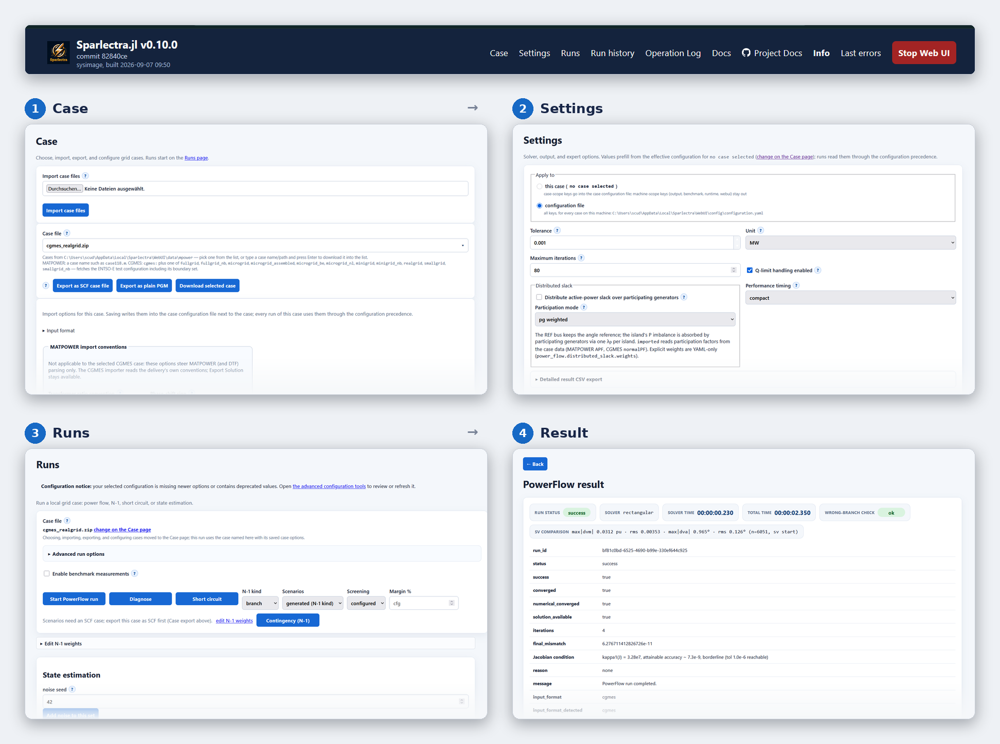

# Sparlectra.jl

Julia package for AC power flow, DC power flow, state estimation and IEC 60909 short circuit

[](https://welthulk.github.io/Sparlectra.jl/)
[](https://github.com/Welthulk/Sparlectra.jl/blob/main/Project.toml)
[](LICENSE)
[](https://julialang.org/)
[](https://colab.research.google.com/github/Welthulk/Sparlectra.jl/blob/main/notebooks/workshop_tour.ipynb)
[](https://github.com/Welthulk/Sparlectra.jl/releases/latest/download/Sparlectra.spdx.json)

**Sparlectra.jl is a Julia framework for steady-state grid analysis: power flow, state estimation, IEC 60909 short circuit, and N-1 contingency studies, with CGMES and MATPOWER exchange.**

<a href="https://github.com/Welthulk/Sparlectra.jl/tree/main/"></a>

Sparlectra covers the complete workflow from network import through solving to configurable reporting. Grid data can be read from ENTSO-E CGMES (2.4.15 and 3.0), MATPOWER, native DTF, and the Sparlectra Case Format (a power-grid-model compatible JSON case), or built programmatically. Three solver backends are available: the built-in rectangular Newton-Raphson solver, a linear DC power flow, and the analytic power-series solver APSLF (AnalyticLoadFlow.jl, a required dependency) usable standalone, as the primary solver, or as a guarded start-value generator ahead of Newton-Raphson.

Every stage of the numerical pipeline is documented and accessible at runtime: model construction, Jacobian assembly, PV/PQ active-set handling and convergence behaviour can be inspected and instrumented. Together with deterministic, configuration-driven runs, explicit Q-limit and AC-island handling and machine-readable reporting, this suits production grid studies and planning work as well as algorithm development and solver benchmarking.

---

## Try it in your browser

No installation required, the workshop notebooks run on Google Colab:

| Notebook | Open |
|---|---|
| `[Intro]` **Workshop tour, basic**: Newcomer to Advanced: first network step by step, model editing and Q-limits, slack types and short circuit, OLTC tap control, Q(U) control | [](https://colab.research.google.com/github/Welthulk/Sparlectra.jl/blob/main/notebooks/workshop_tour.ipynb) |
| `[Advanced]` **Workshop tour, advanced**: Expert and Beyond: remote voltage control, a steerable HVDC link, state estimation, FACTS devices (incl. the full UPFC) and their limits, N-1 contingency analysis, parallel sweeps on Julia threads | [](https://colab.research.google.com/github/Welthulk/Sparlectra.jl/blob/main/notebooks/workshop_tour_advanced.ipynb) |
| `[Trafo ctrl]` **Workshop tour, part 3** (Advanced and up): coordinated transformer control: the circulating-current trap of parallel units, the master/slave group, and the CGMES RegulatingControl mapping | [](https://colab.research.google.com/github/Welthulk/Sparlectra.jl/blob/main/notebooks/workshop_tour_control.ipynb) |
| `[CGMES]` **Workshop tour, CGMES** (Expert): anatomy of an ENTSO-E delivery, the import analysis, bus-branch import with SV validation, node-breaker with and without a TP profile, the export round trip, on the official conformity test sets | [](https://colab.research.google.com/github/Welthulk/Sparlectra.jl/blob/main/notebooks/workshop_tour_cgmes.ipynb) |
| `[Slack+SC]` **Slack types and short circuit** (Advanced): ideal slack vs. external-grid source vs. distributed slack on one 8-bus network, plus IEC 60909-0 fault currents | [](https://colab.research.google.com/github/Welthulk/Sparlectra.jl/blob/main/notebooks/workshop_slack_short_circuit.ipynb) |
| `[Slack]` **Distributed slack** (Advanced): how the participation weights are determined (schedule, capacity, headroom, imported APF/normalPF, explicit), how they are normalized, and the fallback when no valid participant exists | [](https://colab.research.google.com/github/Welthulk/Sparlectra.jl/blob/main/notebooks/workshop_distributed_slack.ipynb) |
| `[Trafo taps]` **Transformer taps** (Advanced): ratio taps (OLTC) move voltage, phase taps (PST/Schrägregler) move power; device tap math, the closed control loop with the X(α) characteristic, and the 3WT star equivalent | [](https://colab.research.google.com/github/Welthulk/Sparlectra.jl/blob/main/notebooks/workshop_transformers.ipynb) |
| `[FACTS]` **FACTS flow control: TCSC to UPFC** (Expert): why flow follows reactance, how the series-reactance controller (TCSC) steers a loop-network flow split onto a branch target, and the full **UPFC** (unified power flow controller): the SSSC+STATCOM composite and the DC-link-coupled model that holds a line's P and Q independently | [](https://colab.research.google.com/github/Welthulk/Sparlectra.jl/blob/main/notebooks/workshop_series_compensation.ipynb) |
| `[N-1]` **Scenarios and screening** (Advanced): outages and operating changes as data in the SCF scenarios block, N-1 expansion, hand-written patch scenarios through `runScenarios!`, contingency screening off against flag, and the block written back into the case file | [](https://colab.research.google.com/github/Welthulk/Sparlectra.jl/blob/main/notebooks/workshop_scenarios.ipynb) |
| `[SE]` **State estimation** (Advanced to Expert): derive a noisy measurement set from a reference power flow, check observability with a placement deep dive (incl. PMU phasors and the reference-angle offset), run the WLS estimator, and see when observability breaks down | [](https://colab.research.google.com/github/Welthulk/Sparlectra.jl/blob/main/notebooks/workshop_state_estimation.ipynb) |

The notebooks are generated from the Literate.jl sources in [docs/lit/](docs/lit/); the same content is on the documentation pages under [Notebooks](https://welthulk.github.io/Sparlectra.jl/generated/workshop_tour/).

---

## Why Sparlectra?

| Requirement | Sparlectra approach |
|---|---|
| Reproducible AC power-flow studies | Deterministic, configuration-driven framework runs |
| Insight into Newton-Raphson internals | Rectangular complex-state formulation, open at every stage |
| Robust PV/PQ handling | Explicit Q-limit enforcement with active-set diagnostics |
| Grid data exchange | ENTSO-E CGMES (2.4.15 and 3.0), MATPOWER, native DTF and Sparlectra Case Format import with validation against the delivered solution; CGMES, MATPOWER and case-format export |
| Short-circuit analysis | Balanced short-circuit currents (Ik'', Sk'', i_p) per IEC 60909-0 from CGMES short-circuit data, with safety flagging of substituted defaults |
| State estimation with observability | Nonlinear WLS estimation with global/local observability checks, critical-measurement reporting, normalized-residual bad-data identification and island-wise solving |
| Custom solver integration | Clean `PFModel` / `PFSolution` interface for external solvers |
| Voltage- and tap-control studies | Outer-loop control framework: transformer regulation (OLTC/PST/combined incl. tap-dependent PST reactance), remote voltage control via machine reactive power, and SVC-style variable-shunt voltage control |
| Realistic slack modeling | Distributed active-power slack with configurable participation factors (incl. imported MATPOWER `APF` / CGMES `normalPF`) |
| Alternative solver backend | Optional analytic power-series solver (APSLF, via AnalyticLoadFlow.jl): standalone, as the primary solver, or as an NR start-value generator |
| State estimation | Nonlinear weighted-least-squares workflow |
| Scalability | Sparse-matrix-oriented implementation for realistic network sizes |

---

## Main features

- Rectangular complex-state Newton-Raphson AC power flow, plus a linear DC power flow.
- Sparse-matrix-oriented implementation for realistic network studies.
- PV/PQ bus handling with Q-limit enforcement (machine capability curves where the data provides them) and active-set diagnostics.
- Distributed active-power slack over configurable participation factors: the primary-control picture instead of a single slack machine.
- Grid import from ENTSO-E CGMES 2.4.15 and 3.0 (EQ/SSH/TP/SV, boundary sets, multi-area assemblies, tap controllers, validation against the delivered SV profile, measured across the full ENTSO-E conformity collection including the 6209-bus RealGrid; the non-converging completeness sets are known and documented), MATPOWER cases and native DTF files.
- CGMES export as a complete delivery (EQ + TP + SSH + SV, optionally one re-importable ZIP: buses, lines, 2W/3W transformers incl. tap machinery, loads, machines, injections, SVCs, shunts, links, operating point and voltage state) with roundtrip-stable object identity: an exported and re-imported network solves to the same power flow and reproduces the original short-circuit evaluation; imported mRIDs are preserved, everything else gets deterministic ids.
- Balanced short-circuit analysis per IEC 60909-0 (`runShortCircuit!`): initial symmetrical current Ik'' (max/min case), Sk'' and peak current i_p per fault bus from harvested CGMES short-circuit data, with explicit safety flagging where defaults were substituted; all-bus sweeps run on Julia threads or via the Takahashi selected inverse (`sweep_method = :takahashi`).
- Network modeling: buses, lines, transformers, generators, loads, shunts, links, and π-equivalent branch models.
- Outer-loop control framework: transformer tap/voltage control (OLTC, PST with tap-dependent reactance, combined regulation), remote voltage control via machine reactive power, and SVC-style variable-shunt voltage control, all reported through one generic controllable-element view.
- Configuration-driven batch execution for systematic case studies.
- External-solver integration via the `PFModel` / `PFSolution` interface, including an optional analytic power-series solver (APSLF, via AnalyticLoadFlow.jl) usable standalone, as the primary solver, or as a Newton-Raphson start-value generator.
- Nonlinear weighted-least-squares state estimation (`runse!`) with built-in observability analysis: global and local observability with structural and numerical checks (`evaluate_global_observability` / `evaluate_local_observability`), critical-versus-redundant measurement classification, bad-data identification through normalized residuals on the residual covariance with w_ii as the localizability indicator and a correlation bound for singly redundant groups, zero-injection handling, island-wise solving, PMU current phasors with the reference-angle offset as an estimated state, and the Takahashi selected inverse powering the diagnostics.
- Machine-readable reporting (`ACPFlowReport`) and an optional local Web UI.

## Scope

- In scope: steady-state grid analysis: AC and DC power flow, WLS state estimation, IEC 60909 short-circuit currents, N-1 contingency batches, CGMES/MATPOWER/DTF exchange.
- Out of scope: dynamic simulation (RMS/EMT), optimal power flow, protection coordination beyond IEC 60909 currents.

---

## Startup latency

Julia compiles on first use: the first power-flow run in a fresh process is
slow, later runs in the same process are fast. Keep the process running, or
build a sysimage once with `buildSysimage()`. Sparlectra runs on an
installed Julia; the sysimage shortens the start, it does not replace the
installation.

The sysimage is not tied to the Web UI. Build it once and start any Julia
session with it:

```julia
using Sparlectra
buildSysimage()          # prints the path it wrote
```

```bash
julia --sysimage ~/.local/state/sparlectra/webui/sysimage/sparlectra.so --project=. my_script.jl
```

The session then has Sparlectra compiled in: `using Sparlectra` returns at
once and the first `runpf!` runs at full speed, whether the script opens
the Web UI, runs a batch, or is used interactively. Details and a
copy-paste quickstart are in the
[integration guide](https://welthulk.github.io/Sparlectra.jl/integration/).

## Installation

As a Julia package:

```julia
using Pkg
Pkg.add("Sparlectra")
```

```julia
using Sparlectra
```

### Web UI: one-line install (no git, no GitHub checkout)

The install scripts also run straight from this page. They install Julia
when it is missing (official juliaup installer; on Windows via winget),
download Sparlectra at its **latest tagged release** into a `Sparlectra/`
folder inside the current directory, and start the Web UI. Run the command
in the directory where Sparlectra should live. The first start offers to
build the [sysimage](https://welthulk.github.io/Sparlectra.jl/sysimage/)
(a one-time build of 10 to 20 minutes; afterwards no page compiles on first
use). No answer means yes; `n` starts without it.

Linux/macOS:

```sh
curl -fsSL https://raw.githubusercontent.com/Welthulk/Sparlectra.jl/main/tools/install_webui.sh | sh
```

Windows (PowerShell):

```powershell
iwr -useb https://raw.githubusercontent.com/Welthulk/Sparlectra.jl/main/tools/install_webui.bat -OutFile install_webui.bat; .\install_webui.bat
```

**Security note:** these one-line commands download a script from the
network and execute it directly, which is inherently risky. Review
[tools/install_webui.sh](tools/install_webui.sh) or
[tools/install_webui.bat](tools/install_webui.bat) before running them, or
clone the repository and start from the checkout instead.

For unattended installs, `SPARLECTRA_BUILD_SYSIMAGE=1` builds the image
during the installation instead of at the first start. It can also be
rebuilt at any time: `./start_webui.sh --rebuild-sysimage`, or
`julia tools/build_sysimage.jl` from the Sparlectra folder.

The installer also offers a desktop shortcut (Windows `.lnk`) or launcher
(`.desktop` file, symlink fallback) for restarting the Web UI later;
`SPARLECTRA_CREATE_SHORTCUT=1` or `=0` answers that question without a
prompt.

**Updating:** re-running the same command is the update path. With an
existing `Sparlectra/` copy the installer compares it against the latest
tagged release and offers the update (default yes; `SPARLECTRA_UPDATE=1`
or `=0` answers without a prompt). The previous copy is kept as
`Sparlectra.old` until you delete it, and a sysimage from the old version
is detected as stale, so the next start offers a rebuild.

### Software Bill of Materials (SBOM)

Every GitHub release ships an SPDX SBOM (`Sparlectra-<tag>.spdx.json`) as a
release asset, generated by CI; the latest one is always available under
the stable link
[releases/latest/download/Sparlectra.spdx.json](https://github.com/Welthulk/Sparlectra.jl/releases/latest/download/Sparlectra.spdx.json)
(also the SBOM badge at the top of this page). It lists the full
dependency tree with licenses; since no `Manifest.toml` is checked in, it
describes the resolution at generation time (stated in its
`CreatorComment`). Generate
one locally with `julia tools/generate_sbom.jl [outfile]` from a checkout
(the PkgToSoftwareBOM tooling lives in a shared build environment and
never enters the package `Project.toml`);
`SPARLECTRA_SBOM_NO_LICENSESCAN=1` skips the per-package license scan.

### Web UI start scripts

The repository ships ready-made scripts for the local Web UI (start
scripts in the root, the installers under `tools/`):

| | Linux/macOS | Windows |
|---|---|---|
| Start (Julia already installed) | `./start_webui.sh` | `start_webui.bat` |
| Install and start | `./tools/install_webui.sh` | `tools\\install_webui.bat` |

`start_webui.sh` / `start_webui.bat` start the Web UI from the checkout
(resolving Julia dependencies once on first start). If Julia is missing they
point at the install script instead of failing cryptically.

`install_webui.sh` / `install_webui.bat` are combined install-and-start
scripts: they install Julia when it is missing (official juliaup installer;
on Windows via winget, no git required there), obtain Sparlectra at its
**latest tagged release** (an existing checkout is used in place; a clean
git tree is moved to the release tag, local changes are never touched;
outside a checkout the release is cloned or downloaded next to the script),
and then start the Web UI, which offers the sysimage build (see above).

---

## Quick start

`run_sparlectra` is the primary framework entry point. It orchestrates import, configuration, optional control-loop execution, solving, post-processing and configured output. For AC power-flow scripts, `run_acpflow` remains available as a thin compatibility alias with the same signature.

The example below runs from a fresh checkout or package installation; `ensure_casefile` downloads `case14.m` on demand if it is not present locally.

```julia
using Sparlectra

case_path = ensure_casefile("case14.m")

result = run_sparlectra(
    casefile = basename(case_path),
    path = dirname(case_path),
)

println(result.outcome)
println(result.iterations)
println(result.final_mismatch)
```

Reading an ENTSO-E CGMES delivery works the same way: diagnose first, then import and solve:

```julia
using Sparlectra

summary = summarizeCGMES(path = ["grid.zip", "boundary.zip"])   # profiles, classes, dangling references
result  = importCGMES(path = ["grid.zip", "boundary.zip"])
runpf!(result.net, 30, 1e-8, 0)

cmp = compareWithSV(result)     # validate against the delivery's own SV profile
@show cmp.max_dvm
```

For custom network construction, batch execution, solver internals, and the local Web UI, see the documentation linked below.

---

## Local Web UI

Sparlectra ships with an optional browser-based local Web UI for power-flow studies, including run history, artifacts and case management. Cases can be selected from the local cache, uploaded (MATPOWER, DTF, CGMES ZIPs) or fetched by name. See the [Web UI documentation](https://welthulk.github.io/Sparlectra.jl/webui/) for setup and configuration.

**From case to result in four steps**: import and choose a case, set solver and
output options, start the run, and read the result with its convergence report:

[](docs/src/assets/webui_v0.10.0.png)

**Power flow run & history**: result with convergence report (left) and the run history (right):

[](docs/src/assets/webui_powerflow_history.png)

---

## API entry points

| Layer | Function | Purpose |
|---|---|---|
| Framework | `run_sparlectra` (`run_acpflow` alias) | Import/config/control/solve/output orchestration for one run |
| Framework batch | `run_sparlectra_cases` | Sequential deterministic execution of configured `matpower_import.cases` |
| Solver | `runpf!` | Solve an already built `Net` using `PowerFlowConfig` |
| Alternative solver | `apslf_solver` | Reachability point for the APSLF (AnalyticLoadFlow.jl) external-solver backend |
| Control | `run_control!` | Execute outer-loop controllers |
| Import | `createNetFromMatPowerFile` | Convert a MATPOWER file into a `Net` without the full framework workflow |
| Import | `importCGMES` / `createNetFromCGMES` | Read an ENTSO-E CGMES delivery into a `Net`, with `summarizeCGMES` for diagnosis and `compareWithSV` for validation |
| Export | `writeCGMESFiles` | Write a `Net` as a complete CGMES delivery (EQ+TP+SSH+SV, optional ZIP) with roundtrip-stable mRIDs |
| Short circuit | `runShortCircuit!` | Balanced short-circuit currents (IEC 60909-0) from harvested CGMES short-circuit data |
| State estimation | `runse!` | Weighted-least-squares estimation on the net's measurement set, with bad-data diagnostics and the se_view summary |
| Observability | `evaluate_global_observability` / `evaluate_local_observability` | Structural and numerical observability, quality labels, critical-measurement classification; the local form runs on a chosen state subset for placement studies |

---

## Documentation

Full documentation: <https://welthulk.github.io/Sparlectra.jl/>

Key entry points:

- [Local Web UI](https://welthulk.github.io/Sparlectra.jl/webui/): browser-based local power-flow workflow
- [Workshop Tour](docs/src/generated/workshop_tour.md): building and manipulating network models step by step
- [Import/Export](docs/src/import.md) · [CGMES Import](docs/src/cgmes_import.md) · [CGMES Export](docs/src/cgmes_export.md): reading and writing grid data
- [Short-Circuit Analysis](docs/src/short_circuit.md): balanced short-circuit currents per IEC 60909-0
- [Branch Model](docs/src/branchmodel.md) · [Remote Voltage Control](docs/src/remote_voltage_control.md): line/transformer modeling, tap and voltage control
- [Solver Guide](docs/src/solver.md) · [External Solvers](docs/src/external_solvers.md): numerical formulations and the `PFModel`/`PFSolution` interface
- [State Estimation](docs/src/state_estimation.md): WLS state-estimation workflow
- [Feature Matrix](docs/src/feature_matrix.md): capability overview
- [Function Reference](docs/src/reference.md) · [Workshop tour](docs/src/generated/workshop_tour.md): API reference and guided examples
- [Changelog](docs/src/changelog.md): version history

---

## Contributing

Contributions, bug reports, test cases and documentation improvements are welcome, particularly reproducible test networks, import edge cases (CGMES, MATPOWER, DTF), and improved diagnostics.

Questions and feedback: see [Discussions](https://github.com/Welthulk/Sparlectra.jl/discussions).

Please read [CONTRIBUTING.md](CONTRIBUTING.md) and [CODE_OF_CONDUCT.md](CODE_OF_CONDUCT.md) before contributing.

---

## Citing Sparlectra

If you use Sparlectra.jl in research, engineering studies, presentations, or reports, please cite the repository:

```bibtex
@software{sparlectra_jl,
  title  = {Sparlectra.jl: A Power-Flow and State-Estimation Framework in Julia},
  author = {Schmitz, Udo},
  year   = {2026},
  url    = {https://github.com/Welthulk/Sparlectra.jl}
}
```

---

## License

Sparlectra.jl is licensed under the Apache License, Version 2.0.

See [LICENSE](LICENSE) for the full license text.
