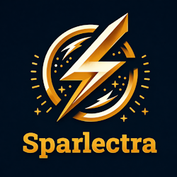
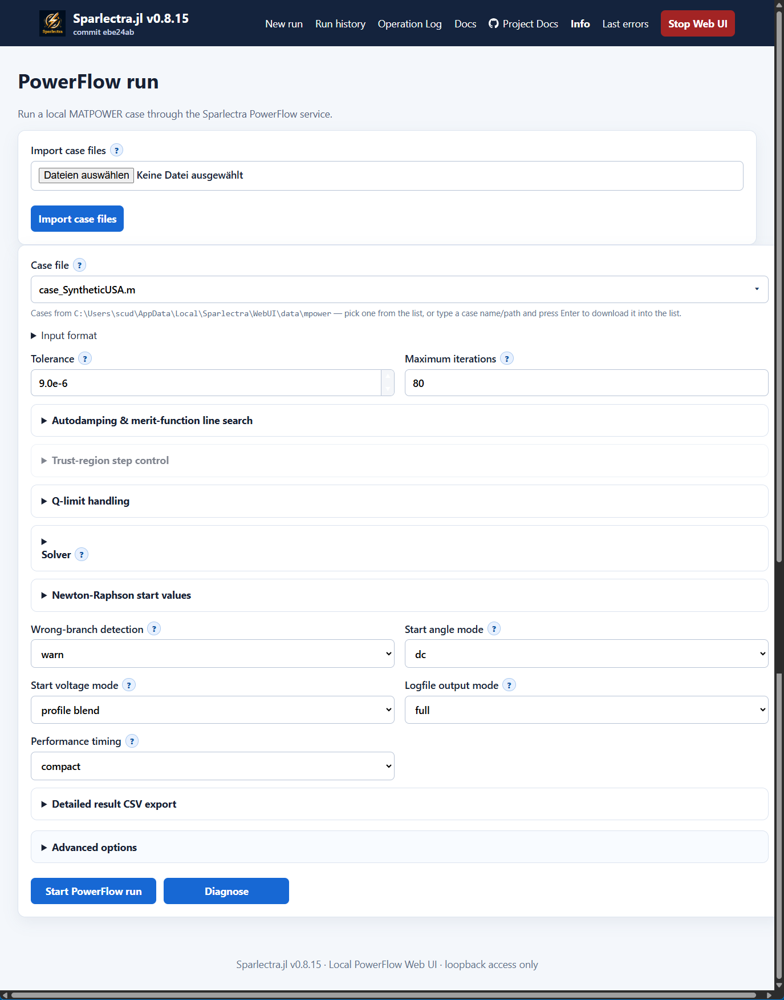
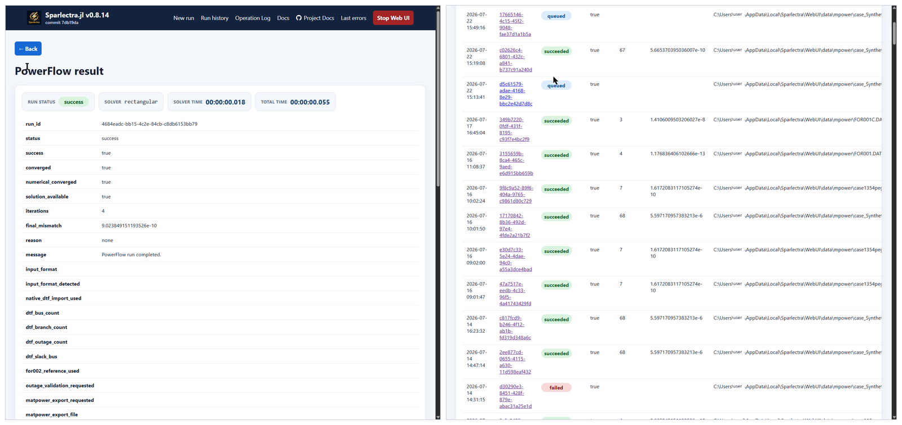

# Sparlectra.jl

[](https://welthulk.github.io/Sparlectra.jl/)
[](https://github.com/Welthulk/Sparlectra.jl/blob/main/Project.toml)
[](LICENSE)
[](https://julialang.org/)

**Sparlectra.jl is a Julia framework for AC power-flow and state-estimation studies.**

<a href="https://github.com/Welthulk/Sparlectra.jl/tree/main/"></a>

Sparlectra covers the complete workflow from network import through solving to configurable reporting. Grid data can be read from ENTSO-E CGMES (2.4.15 and 3.0), MATPOWER and native DTF sources, or built programmatically. Three solver backends are available: the built-in rectangular Newton-Raphson solver, a linear DC power flow, and an optional analytic power-series solver (APSLF, via the AnalyticLoadFlow.jl package extension) usable standalone, as the primary solver, or as a guarded start-value generator ahead of Newton-Raphson.

Every stage of the numerical pipeline is documented and accessible at runtime — model construction, Jacobian assembly, PV/PQ active-set handling and convergence behaviour can be inspected and instrumented. Together with deterministic, configuration-driven runs, explicit Q-limit and AC-island handling and machine-readable reporting, this suits production grid studies and planning work as well as algorithm development and solver benchmarking.

---

## Why Sparlectra?

| Requirement | Sparlectra approach |
|---|---|
| Reproducible AC power-flow studies | Deterministic, configuration-driven framework runs |
| Insight into Newton-Raphson internals | Rectangular complex-state formulation, open at every stage |
| Robust PV/PQ handling | Explicit Q-limit enforcement with active-set diagnostics |
| Grid data exchange | ENTSO-E CGMES (2.4.15 and 3.0), MATPOWER and native DTF import with validation against the delivered solution |
| Custom solver integration | Clean `PFModel` / `PFSolution` interface for external solvers |
| Voltage- and tap-control studies | Outer-loop control framework: transformer regulation (OLTC/PST/combined) and remote voltage control via machine reactive power |
| Realistic slack modeling | Distributed active-power slack with configurable participation factors (incl. imported MATPOWER `APF` / CGMES `normalPF`) |
| Alternative solver backend | Optional analytic power-series solver (APSLF, via AnalyticLoadFlow.jl) — standalone, as the primary solver, or as an NR start-value generator |
| State estimation | Nonlinear weighted-least-squares workflow |
| Scalability | Sparse-matrix-oriented implementation for realistic network sizes |

---

## Main features

- Rectangular complex-state Newton-Raphson AC power flow, plus a linear DC power flow.
- Sparse-matrix-oriented implementation for realistic network studies.
- PV/PQ bus handling with Q-limit enforcement (machine capability curves where the data provides them) and active-set diagnostics.
- Distributed active-power slack over configurable participation factors — the primary-control picture instead of a single slack machine.
- Grid import from ENTSO-E CGMES 2.4.15 and 3.0 (EQ/SSH/TP/SV, boundary sets, multi-area assemblies, tap controllers, validation against the delivered SV profile — measured across the full ENTSO-E conformity collection including the 6209-bus RealGrid; per-case results incl. the documented non-converging completeness sets in [docs/dev/cgmes_testset_overview.md](docs/dev/cgmes_testset_overview.md)), MATPOWER cases and native DTF files.
- Comprehensive network modeling: buses, lines, transformers, generators, loads, shunts, links, and π-equivalent branch models.
- Outer-loop control framework: transformer tap/voltage control (OLTC, PST, combined regulation) and remote voltage control via machine reactive power.
- Configuration-driven batch execution for systematic case studies.
- External-solver integration via the `PFModel` / `PFSolution` interface, including an optional analytic power-series solver (APSLF, via AnalyticLoadFlow.jl) usable standalone, as the primary solver, or as a Newton-Raphson start-value generator.
- Nonlinear weighted-least-squares state estimation.
- Machine-readable reporting (`ACPFlowReport`) and an optional local Web UI.

---

## Installation

```julia
using Pkg
Pkg.add("Sparlectra")
```

```julia
using Sparlectra
```

---

## Quick start

`run_sparlectra` is the primary framework entry point. It orchestrates import, configuration, optional control-loop execution, solving, post-processing and configured output. For AC power-flow scripts, `run_acpflow` remains available as a thin compatibility alias with the same signature.

The example below runs from a fresh checkout or package installation; `ensure_casefile` downloads `case14.m` on demand if it is not present locally.

```julia
using Sparlectra

case_path = ensure_casefile("case14.m")

result = run_sparlectra(
    casefile = basename(case_path),
    path = dirname(case_path),
)

println(result.outcome)
println(result.iterations)
println(result.final_mismatch)
```

Reading an ENTSO-E CGMES delivery works the same way — diagnose first, then import and solve:

```julia
using Sparlectra

summary = summarizeCGMES(path = ["grid.zip", "boundary.zip"])   # profiles, classes, dangling references
result  = importCGMES(path = ["grid.zip", "boundary.zip"])
runpf!(result.net, 30, 1e-8, 0)

cmp = compareWithSV(result)     # validate against the delivery's own SV profile
@show cmp.max_dvm
```

For custom network construction, batch execution, solver internals, and the local Web UI, see the documentation linked below.

---

## Local Web UI

Sparlectra ships with an optional browser-based local Web UI for power-flow studies, including run history, artifacts and case management. Cases can be selected from the local cache, uploaded (MATPOWER, DTF, CGMES ZIPs) or fetched by name. See the [Web UI documentation](https://welthulk.github.io/Sparlectra.jl/webui/) for setup and configuration.

**Configuration** — case selection, solver settings, control options and output configuration on a single page:

<p align="center">
  <a href="docs/src/assets/webui_v0.8.15.png"></a>
</p>

**Power flow run & history** — result with convergence report (left) and the run history (right):

<p align="center">
  <a href="docs/src/assets/webui_powerflow_history.png"></a>
</p>

---

## API entry points

| Layer | Function | Purpose |
|---|---|---|
| Framework | `run_sparlectra` (`run_acpflow` alias) | Import/config/control/solve/output orchestration for one run |
| Framework batch | `run_sparlectra_cases` | Sequential deterministic execution of configured `matpower_import.cases` |
| Solver | `runpf!` | Solve an already built `Net` using `PowerFlowConfig` |
| Alternative solver | `apslf_solver` | Reachability point for the APSLF (AnalyticLoadFlow.jl) external-solver backend |
| Control | `run_control!` | Execute outer-loop controllers |
| Import | `createNetFromMatPowerFile` | Convert a MATPOWER file into a `Net` without the full framework workflow |
| Import | `importCGMES` / `createNetFromCGMES` | Read an ENTSO-E CGMES delivery into a `Net`, with `summarizeCGMES` for diagnosis and `compareWithSV` for validation |

---

## Documentation

Full documentation: <https://welthulk.github.io/Sparlectra.jl/>

Key entry points:

- [Local Web UI](https://welthulk.github.io/Sparlectra.jl/webui/) — browser-based local power-flow workflow
- [Networks](docs/src/networks.md) — building and manipulating network models
- [Import/Export](docs/src/import.md) · [CGMES Import](docs/src/cgmes_import.md) — reading and writing grid data
- [Branch Model](docs/src/branchmodel.md) · [Remote Voltage Control](docs/src/remote_voltage_control.md) — line/transformer modeling, tap and voltage control
- [Solver Guide](docs/src/solver.md) · [External Solvers](docs/src/external_solvers.md) — numerical formulations and the `PFModel`/`PFSolution` interface
- [State Estimation](docs/src/state_estimation.md) — WLS state-estimation workflow
- [Feature Matrix](docs/src/feature_matrix.md) — capability overview
- [Function Reference](docs/src/reference.md) · [Workshop](docs/src/workshop.md) — API reference and guided examples
- [Changelog](docs/src/changelog.md) — version history

---

## Contributing

Contributions, bug reports, test cases and documentation improvements are welcome — particularly reproducible test networks, import edge cases (CGMES, MATPOWER, DTF), and improved diagnostics.

Please read [CONTRIBUTING.md](CONTRIBUTING.md) and [CODE_OF_CONDUCT.md](CODE_OF_CONDUCT.md) before contributing.

---

## Citing Sparlectra

If you use Sparlectra.jl in research, engineering studies, presentations, or reports, please cite the repository:

```bibtex
@software{sparlectra_jl,
  title  = {Sparlectra.jl: A Power-Flow and State-Estimation Framework in Julia},
  author = {Schmitz, Udo},
  year   = {2026},
  url    = {https://github.com/Welthulk/Sparlectra.jl}
}
```

---

## License

Sparlectra.jl is licensed under the Apache License, Version 2.0.

See [LICENSE](LICENSE) for the full license text.
