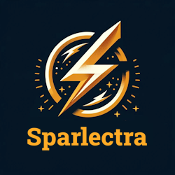

[](https://welthulk.github.io/Sparlectra.jl/)


# SPARLECTRA
<a href="https://github.com/Welthulk/Sparlectra.jl/tree/main/"></a>

This package contains tools for subsequent network calculations. It primarily features a program for calculating load flow using the Newton-Raphson method. The focus is to provide valuable insights into load flow calculations for both students and ambitious professionals.

---

## Installation
```julia
using Pkg
Pkg.add("Sparlectra")
```

### Network Creation
This package supports the import and export of Matpower .m files, although currently it only reads bus, generator, and branch data from these files. Please note that additional Matlab functions within the .m file are not supported. Additionally, you can modify the imported Matpower files or you can create your own network using easy-to-use functions provided by the package.

### Test Cases and Benchmarks

Sparlectra does not ship third-party power system test cases by default.

Instead, MATPOWER-compatible case files (e.g. `case14`, `case118`) can be
downloaded **on demand** using helper scripts provided with the package.
Downloaded files are stored locally and are not part of the Sparlectra source
distribution.

This approach keeps the repository lightweight and avoids bundling external
data while still allowing reproducible experiments and benchmarks.


### License
This project is licensed under the Apache License, Version 2.0.
[The license file](LICENSE) contains the complete licensing information.


