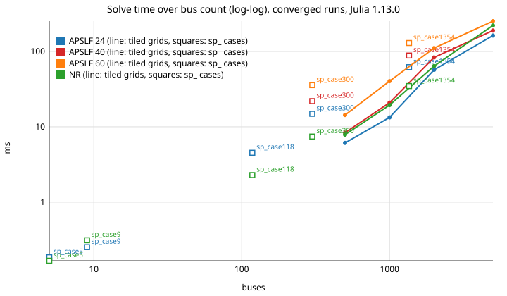

# Performance and Profiling Configuration

## [Runtime](@id perf-runtime)

Process-level settings read once at startup: the thread report, the Julia and BLAS thread counts, and the parallel work split of the sweeps.

| YAML path | Type | Default | Allowed values | Meaning |
|---|---:|---:|---|---|
| `runtime.print_thread_config` | Bool | `true` | `true`, `false` | Print Julia/BLAS thread summary at startup, including the `parallel: enabled=... max_tasks=...` line. |
| `runtime.julia_threads` | String | `keep` | `keep`, `default`, `off`, `auto`, or integer-like string | Julia thread policy for runner setup. Requires process startup (`--threads`) or script re-exec. |
| `runtime.blas_threads` | String | `keep` | `keep`, `default`, `off`, `auto`, or integer-like string | BLAS thread policy for runner setup and can be applied at runtime. |
| `runtime.parallel.enabled` | Bool | `true` | `true`, `false` | Master switch for in-process parallel execution of independent work items (island solves, short-circuit sweeps, contingency batches). `false` forces every parallel site onto the serial path (the same functions, not copies). |
| `runtime.parallel.max_tasks` | String | `auto` | `auto` or positive integer string | Task cap for parallel sites. `auto` resolves to `Threads.nthreads()`; the cap is applied via chunking, so it also bounds `@threads` sites. |
| `runtime.parallel.min_work_items` | Int | `4` | integer >= 1 | Work lists shorter than this run serially (avoids task overhead on tiny cases). |

In a single-threaded Julia process the parallel sites run serially even
with `runtime.parallel.enabled: true`; the startup summary prints a hint
to start with `julia --threads=auto`.

Per-phase timings in the performance profile (and `performance.log`) are
CPU-time sums across all islands/workers; the elapsed real time of a
fan-out is accounted separately under `parallel_wall_time`, and the ratio
is the achieved speedup.

Julia thread priority for `examples/powerflow/matpower_import.jl`:

1. CLI override: `--julia-threads=<N|auto|keep>`
2. Environment override: `SPARLECTRA_JULIA_THREADS`
3. YAML `runtime.julia_threads`
4. keep current process setting

```bash
julia --threads=8 --project=. examples/powerflow/matpower_import.jl
julia --project=. examples/powerflow/matpower_import.jl --julia-threads=8
```

```powershell
$env:JULIA_NUM_THREADS = "8"
julia --project=. examples/powerflow/matpower_import.jl
```

## APSLF against Newton: solve times

`examples/others/apslf_vs_nr_timing.jl` solves the shipped `sp_` cases and
synthetic tiled grids (500 to 5000 buses, `SPARLECTRA_TIMING_SIZES`) with
the rectangular Newton solver and with APSLF at orders 24, 40 and 60
(higher orders from 300 buses on, `SPARLECTRA_TIMING_ORDERS`), median of
three warm runs, convergence-radius evaluation off. It writes
`apslf_vs_nr_timing.csv` and `apslf_vs_nr_timing.svg` into
`results/apslf_vs_nr_timing/`; below: Linux, Julia 1.13.0, 16 threads.

On pure-PQ grids (the tiled grids) the series solve is faster than Newton
from 500 buses on, with cost about linear in the order; cases with PV
buses and reactive limits (the `sp_` cases) need outer passes and are
Newton's ground. Networks with controllers do not run under APSLF (use
the hybrid start, see the APSLF workshop).



| case | buses | PV buses | solver | order | outcome | it / passes | time |
|---|---:|---:|---|---:|---|---:|---:|
| `sp_case9` | 9 | 3 | NR | - | converged | 5 | 0.3 ms |
| `sp_case9` | 9 | 3 | APSLF | 24 | converged | 1 | 0.2 ms |
| `sp_case118` | 118 | 54 | NR | - | converged | 6 | 2.3 ms |
| `sp_case118` | 118 | 54 | APSLF | 24 | converged | 3 | 4.5 ms |
| `sp_case300` | 300 | 69 | NR | - | converged | 7 | 7.4 ms |
| `sp_case300` | 300 | 69 | APSLF | 24 | converged | 4 | 14.9 ms |
| `sp_case300` | 300 | 69 | APSLF | 40 | converged | 4 | 21.9 ms |
| `sp_case300` | 300 | 69 | APSLF | 60 | converged | 4 | 35.7 ms |
| `sp_case1354` | 1354 | 260 | NR | - | converged | 8 | 34.7 ms |
| `sp_case1354` | 1354 | 260 | APSLF | 24 | converged | 3 | 61.8 ms |
| `sp_case1354` | 1354 | 260 | APSLF | 40 | converged | 3 | 88.3 ms |
| `sp_case1354` | 1354 | 260 | APSLF | 60 | converged | 3 | 129.4 ms |
| `sp_case5` | 5 | 2 | NR | - | converged | 1 | 0.2 ms |
| `sp_case5` | 5 | 2 | APSLF | 24 | converged | 1 | 0.2 ms |
| `tiled_500` | 500 | 1 | NR | - | converged | 5 | 7.9 ms |
| `tiled_500` | 500 | 1 | APSLF | 24 | converged | 1 | 6.1 ms |
| `tiled_500` | 500 | 1 | APSLF | 40 | converged | 1 | 8.4 ms |
| `tiled_500` | 500 | 1 | APSLF | 60 | converged | 1 | 14.3 ms |
| `tiled_1000` | 1000 | 1 | NR | - | converged | 5 | 19.4 ms |
| `tiled_1000` | 1000 | 1 | APSLF | 24 | converged | 1 | 13.3 ms |
| `tiled_1000` | 1000 | 1 | APSLF | 40 | converged | 1 | 20.9 ms |
| `tiled_1000` | 1000 | 1 | APSLF | 60 | converged | 1 | 40.4 ms |
| `tiled_2000` | 2000 | 1 | NR | - | converged | 5 | 63.8 ms |
| `tiled_2000` | 2000 | 1 | APSLF | 24 | converged | 1 | 56.9 ms |
| `tiled_2000` | 2000 | 1 | APSLF | 40 | converged | 1 | 83.3 ms |
| `tiled_2000` | 2000 | 1 | APSLF | 60 | converged | 1 | 110.9 ms |
| `tiled_5000` | 5000 | 1 | NR | - | converged | 5 | 221.2 ms |
| `tiled_5000` | 5000 | 1 | APSLF | 24 | converged | 1 | 162.7 ms |
| `tiled_5000` | 5000 | 1 | APSLF | 40 | converged | 1 | 189.3 ms |
| `tiled_5000` | 5000 | 1 | APSLF | 60 | converged | 1 | 252.3 ms |

## [Output configuration](@id perf-output)

What a run writes besides its result: the console summary and its diagnostics, the log files, and the detailed CSV export with its writer settings.

| YAML path | Type | Default | Allowed values | Meaning |
|---|---:|---:|---|---|
| `output.console_summary` | Bool | `true` | `true`, `false` | Print compact run summary to console. |
| `output.console_auto_profile` | Symbol/String | `compact` | `off`, `compact`, `full` | MATPOWER auto-profile console detail. |
| `output.console_diagnostics` | Symbol/String | `compact` | `off`, `compact`, `summary`, `full` | Diagnostic detail on console. |
| `output.console_q_limit_events` | Symbol/String | `summary` | `off`, `summary`, `full` | Q-limit/PV→PQ event console detail. |
| `output.console_max_rows` | Int | `100` | non-negative integer | Max rows in compact console tables. |
| `output.logfile_results` | Symbol/String | `off` | `off`, `compact`, `classic`, `full` | Solved result table detail in logfile. |
| `output.detailed_result_csv_write_mode` | Symbol/String | `auto` | `auto`, `buffered`, `streaming` | Detailed CSV artifact write strategy; `auto` streams very large outputs. |
| `output.detailed_result_csv_exporter` | Symbol/String | `auto` | `auto`, `report`, `direct` | Detailed CSV row-generation path; `auto` uses the direct streaming exporter for large bus counts. |
| `output.detailed_result_csv_direct_threshold_buses` | Int | `10000` | positive integer | Bus-count threshold where `auto` switches detailed CSV export from report generation to direct streaming. |
| `output.detailed_result_csv_buffer_initial_bytes` | Int | `8388608` | non-negative integer | Initial size hint for buffered detailed CSV artifact writing. |
| `output.detailed_result_csv_buffer_max_bytes` | Int | `67108864` | positive integer | Cheap estimated-size limit above which `auto` prefers streaming. |
| `output.detailed_result_csv_streaming_threshold_rows` | Int | `100000` | positive integer | Row-count threshold above which `auto` prefers streaming. |
| `output.logfile_diagnostics` | Symbol/String | `compact` | `off`, `compact`, `full` | Diagnostic logfile detail. |
| `output.logfile_performance` | Symbol/String | `compact` | `off`, `compact`, `full` | Performance profile logfile detail. |
| `output.logfile_warnings` | Symbol/String | `table` | `off`, `summary`, `table`, `full` | Warning representation in logfile. |

The `Jacobian cond.` line (estimate plus verdict) is always part of the
classic result output; a leftover `output.condition_number` key in a YAML
file is ignored. See [Solver](solver.md).

For API and Web UI runs, `classic` writes the result output and a compact
summary (`solver_time`, `representative_time`, iterations, final
mismatch, outcome; benchmark median and samples only in benchmark mode).
`full` adds a **Full run details** section with the effective typed
configuration, artifact options and status diagnostics.

## Diagnostics configuration

| YAML path | Type | Default | Allowed values | Meaning | Cost notes |
|---|---:|---:|---|---|---|
| `diagnostics.log_effective_config` | Bool | `false` | `true`, `false` | Log merged effective configuration. | true: low |
| `diagnostics.console_summary` | Bool | `true` | `true`, `false` | Emit compact run summary to console. | true: low |
| `diagnostics.console_auto_profile` | Symbol/String | `compact` | `off`, `compact`, `full` | Auto-profile detail on console. | `full`: medium |
| `diagnostics.console_diagnostics` | Symbol/String | `compact` | `off`, `compact`, `summary`, `full` | Solver diagnostics detail on console. | `full`: medium/high |
| `diagnostics.console_q_limit_events` | Symbol/String | `summary` | `off`, `summary`, `full` | PV→PQ event verbosity on console. | `full`: medium |
| `diagnostics.console_max_rows` | Int | `100` | non-negative integer | Row cap for console diagnostics tables. | low |
| `diagnostics.logfile_diagnostics` | Symbol/String | `compact` | `off`, `compact`, `full` | Diagnostic logfile detail level. | `full`: medium/high |

## Performance configuration

| YAML path | Type | Default | Allowed values | Meaning |
|---|---:|---:|---|---|
| `performance.enabled` | Bool | `true` | `true`, `false` | Enable performance instrumentation. |
| `performance.level` | Symbol/String | `iteration` | `off`, `summary`, `iteration`, `full` | Instrumentation detail level. |
| `performance.print_to_console` | Bool | `true` | `true`, `false` | Emit performance output to console. |
| `performance.write_to_logfile` | Bool | `true` | `true`, `false` | Emit performance output to logfile. |
| `performance.show_allocations` | Bool | `false` | `true`, `false` | Include allocation stats. |
| `performance.show_iteration_table` | Bool | `true` | `true`, `false` | Show iteration-level timing table. |
| `performance.compact_logging` | Bool | `true` | `true`, `false` | Compact performance logging format. |
| `performance.skip_reference_comparison` | Bool | `false` | `true`, `false` | Skip voltage/reference comparisons for speed. |
| `performance.skip_expensive_diagnostics` | Bool | `true` | `true`, `false` | Skip high-cost diagnostics. |
| `performance.skip_branch_neighborhood_report` | Bool | `true` | `true`, `false` | Skip branch neighborhood report. |
| `performance.max_diagnostic_rows` | Int | `25` | non-negative integer | Row cap for diagnostics tables. |

## [Benchmark configuration](@id perf-benchmark)

The Web UI's `performance_timing=off|compact|full` option writes
`performance.log` with the phases of one service/API request (request
parsing, case resolution, configuration, case loading/network
construction/solve, postprocessing, artifact writing, total time; `full`
adds the internal profile entries). `benchmark.enabled` instead performs
repeated solves and reports representative and median timing.

| YAML path | Type | Default | Allowed values | Meaning |
|---|---:|---:|---|---|
| `benchmark.enabled` | Bool | `true` | `true`, `false` | Enable benchmark mode. |
| `benchmark.methods` | Vector{Symbol/String} | `[rectangular]` | `rectangular` (current PF core) | Methods benchmarked. |
| `benchmark.seconds` | Float64 | `2.0` | positive real | Benchmark max. time budget. This is not a minimum runtime, solver timeout, or iteration limit; a running sample is not interrupted. |
| `benchmark.samples` | Int | `50` | positive integer | Max benchmark samples per method. The benchmark may finish earlier when this count is reached before the time budget, or collect fewer samples when the time budget is reached first. |
| `benchmark.show_once` | Bool | `false` | `true`, `false` | Run one full visible solve before timing loop. |
| `benchmark.show_once_output` | Symbol/String | `classic` | `classic`, `dataframe`, `compact` | Output format for `show_once`. |
| `benchmark.show_once_max_nodes` | Int | `0` | non-negative integer | Row cap for one-shot output. |

## Solver workspace and warmup keys

Performance-relevant keys outside the `performance.*` section:

| Key | Default | Meaning |
|---|---|---|
| `power_flow.rectangular_workspace_reuse` | `true` | Reuse the rectangular solver's workspace between solves of one session instead of reallocating. |
| `power_flow.rectangular_preallocate_workspace` | `auto` | Preallocate the workspace up front (`off`, `on`, `auto`; `auto` decides by case size). |
| `power_flow.rectangular_workspace_min_buses` | `1000` | Case size from which `auto` preallocates. |
| `performance.representative_warmup_runs` | `0` | Untimed warmup solves before a timed representative run. |
| `performance.compare_cold_warm` | `false` | Report the cold (first) and warm (subsequent) timings side by side. |
