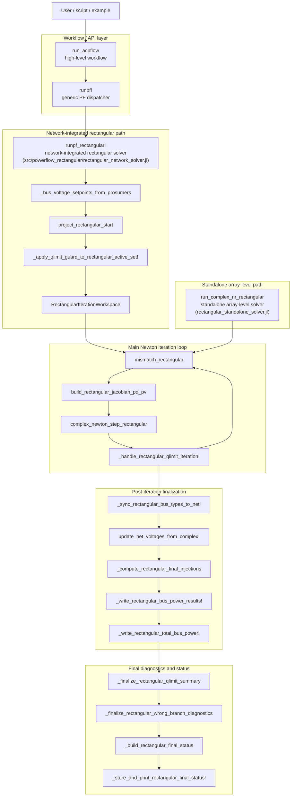

# Rectangular power-flow implementation

## Purpose

This directory contains helper layers for the rectangular complex-state Newton–Raphson power-flow path.

The rectangular implementation is split across several abstraction layers:

| Entry point | Layer | Role |
|---|---|---|
| `run_acpflow` | High-level workflow | Handles case/config input, workflow setup, solver selection, and output/result handling. |
| `runpf!` | Generic power-flow dispatcher | Dispatches to the selected power-flow method. For rectangular runs, it reaches `runpf_rectangular!`. |
| `runpf_rectangular!` | Network-integrated rectangular solver | Orchestrates rectangular power flow on a `Sparlectra.Net`: setup, start projection, Newton loop, Q-limit handling, finalization, diagnostics, and write-back. |
| `run_complex_nr_rectangular` | Standalone array-level solver | Runs the rectangular Newton method directly on `Ybus`, `V0`, and `S`; it does not own full `Net` orchestration. |

`runpf_rectangular!` (in `src/powerflow_rectangular/rectangular_network_solver.jl`) is therefore the network-integrated rectangular entry point and orchestrates the helper layers in this directory.

`run_complex_nr_rectangular` (in this directory) remains the standalone array-level solver for direct matrix/vector use.


## Include order

The includes in `src/Sparlectra.jl` must stay in this dependency-aware order:

```julia
include("powerflow_rectangular/rectangular_core_equations.jl")
include("powerflow_rectangular/rectangular_jacobian_builders.jl")
include("powerflow_rectangular/rectangular_newton_step.jl")
include("powerflow_rectangular/rectangular_standalone_solver.jl")
include("powerflow_rectangular/rectangular_wrong_branch.jl")
include("powerflow_rectangular/rectangular_start_projection.jl")
include("powerflow_rectangular/rectangular_result_updates.jl")
include("powerflow_rectangular/rectangular_voltage_setpoints.jl")
include("powerflow_rectangular/rectangular_qlimit_trace.jl")
include("powerflow_rectangular/rectangular_qlimit_trace_logging.jl")
include("powerflow_rectangular/rectangular_qlimit_vset_adjustment.jl")
include("powerflow_rectangular/rectangular_qlimit_guard.jl")
include("powerflow_rectangular/rectangular_qlimit_iteration.jl")
include("powerflow_rectangular/rectangular_status_workspace.jl")
include("powerflow_rectangular/rectangular_finalization.jl")
include("powerflow_rectangular/rectangular_final_status.jl")
include("powerflow_rectangular/rectangular_network_solver.jl")
```


## File responsibilities

| File | Responsibility | Key functions |
|---|---|---|
| `rectangular_core_equations.jl` | Rectangular mismatch and core equation helpers | `build_complex_jacobian`, `mismatch_rectangular`, `_max_rectangular_pv_voltage_residual` |
| `rectangular_jacobian_builders.jl` | Analytic rectangular Jacobian assembly (sparse and dense diagnostic variants) | `build_rectangular_jacobian_pq_pv_sparse`, `build_rectangular_jacobian_pq_pv_dense`, `build_rectangular_jacobian_pq_pv` |
| `rectangular_newton_step.jl` | Newton step update and autodamping/backtracking | `_validate_rectangular_damping`, `_apply_rectangular_delta`, `choose_rectangular_autodamp`, `complex_newton_step_rectangular` |
| `rectangular_standalone_solver.jl` | Standalone rectangular array-level NR driver | `run_complex_nr_rectangular` |
| `rectangular_start_projection.jl` | Start sanitization, optional DC-angle seed, and blend projection | `_sanitize_rectangular_start`, `_dc_angle_start_rectangular`, `project_rectangular_start` |
| `rectangular_wrong_branch.jl` | Post-solve wrong-branch diagnostics and status classification | `_wrap_to_180_deg`, `_circular_angle_spread_deg`, `_check_wrong_branch_solution` |
| `rectangular_result_updates.jl` | Final complex-voltage write-back into network node fields | `update_net_voltages_from_complex!` |
| `rectangular_voltage_setpoints.jl` | Bus voltage setpoint lookup and fallback preparation for rectangular setup | `_bus_voltage_setpoints_from_prosumers` |
| `rectangular_qlimit_trace.jl` | Q-limit trace bus-ID mapping helpers used by rectangular diagnostics | `_qlimit_original_bus_id`, `_resolve_qlimit_trace_buses` |
| `rectangular_qlimit_trace_logging.jl` | Q-limit trace/logging diagnostics for rectangular active-set decisions | `_bus_has_online_voltage_regulator`, `_qlimit_violation`, `_print_rectangular_qlimit_trace` |
| `rectangular_qlimit_vset_adjustment.jl` | Q-limit `:adjust_vset` controller construction for rectangular workflow | `_build_vset_adjust_controllers` |
| `rectangular_qlimit_guard.jl` | Q-limit guard preprocessing before rectangular active-set iterations | `_apply_qlimit_guard_to_rectangular_active_set!` |
| `rectangular_qlimit_iteration.jl` | Per-iteration Q-limit active-set workflow helper invoked from `runpf_rectangular!` (does not own the full Newton loop) | `_handle_rectangular_qlimit_iteration!` |
| `rectangular_status_workspace.jl` | Rectangular status registry, iteration workspace allocation, and summary/report formatting helpers | `_RectangularPFStatusTable`, `RectangularIterationWorkspace`, `rectangular_pf_status`, `_print_rectangular_convergence_summary`, `_print_qlimit_active_set_summary` |
| `rectangular_finalization.jl` | Post-iteration finalization helpers for bus-type sync, voltage write-back, final injection vectors, and bus/total-power write-back (excluding active Q-limit switching and wrong-branch status decisions) | `_sync_rectangular_bus_types_to_net!`, `_compute_rectangular_final_injections`, `_write_rectangular_bus_power_results!`, `_write_rectangular_total_bus_power!` |
| `rectangular_final_status.jl` | Final Q-limit acceptance/rejection glue, wrong-branch final diagnostics glue, and rectangular PF status build/store helpers (excluding active Q-limit switching loop) | `_finalize_rectangular_qlimit_summary`, `_finalize_rectangular_wrong_branch_diagnostics`, `_build_rectangular_final_status`, `_store_and_print_rectangular_final_status!` |
| `rectangular_network_solver.jl` | Network-integrated rectangular solver loop, public entry glue, and orchestration around helper layers | `runpf_rectangular!`, `runpf!`-related rectangular entry points |

Entry-point note: the previous extra naming layer (`run_complex_nr_rectangular_for_net!`) was removed. `runpf_rectangular!` is now the network-integrated rectangular solver entry point, while `run_complex_nr_rectangular` remains the standalone array-level solver.

## Execution flow

High-level rectangular PF flow in the current split:

1. Build or access Y-bus and initial complex voltage state.
2. Build specified injections (`S`) for the current network state.
3. Resolve bus types and voltage setpoints.
4. Optionally project/sanitize the rectangular start.
5. Run Newton iterations via the standalone array solver (`run_complex_nr_rectangular`) using rectangular mismatch and Newton-step helpers.
6. Optionally apply autodamping backtracking.
7. Apply Q-limit guard preprocessing, then handle active PV→PQ switching logic in the network solver loop in `rectangular_network_solver.jl`.
8. Write final complex voltages back to node magnitude/angle fields.
9. Run wrong-branch diagnostics/status reporting where configured.

## Architecture and call diagram

The **include order** above is the dependency/load order. The **runtime call order** below shows how the rectangular solver path is executed.



## Entry-point layers

The rectangular implementation should be read from top to bottom as layered orchestration:

| Function | Layer | Typical caller | Owns `Sparlectra.Net` orchestration? | Main responsibility |
|---|---|---|---:|---|
| `run_acpflow` | Workflow/API | examples, scripts, user-facing workflows | Yes, indirectly | Load/apply configuration, prepare input, select solver path, handle output. |
| `runpf!` | Generic dispatcher | high-level PF workflows | Partly | Dispatch to the configured PF method. |
| `runpf_rectangular!` | Network-integrated solver | `runpf!`, solver-interface paths | Yes | Run rectangular PF on `Net`, including setup, Q-limit workflow, finalization, diagnostics, and write-back. |
| `run_complex_nr_rectangular` | Standalone numerical solver | tests, experiments, low-level callers | No | Run rectangular Newton on `Ybus`, `V0`, `S` without full network object handling. |

The important distinction is:

```text
runpf_rectangular! != run_complex_nr_rectangular
```

`runpf_rectangular!` is the full network-integrated rectangular solver. It knows about `Net`, bus types, generator voltage setpoints, Q-limits, start projection, final write-back, and solver status.

`run_complex_nr_rectangular` is the lower-level array solver. It works directly on matrix/vector data and does not perform full `Net` finalization or workflow handling.

## Architectural notes

- `run_acpflow` is the high-level workflow entry point. It is not the numerical solver itself.
- `runpf!` is the generic power-flow dispatch layer.
- `runpf_rectangular!` is the **network-integrated** rectangular solver. It owns the high-level orchestration: setup, Newton loop sequencing, Q-limit handling, finalization, and final status handling.
- `run_complex_nr_rectangular` is the **standalone array-level** solver path. It shares lower-level rectangular helper layers but is not responsible for full network object orchestration.
- `rectangular_core_equations.jl`, `rectangular_jacobian_builders.jl`, and `rectangular_newton_step.jl` form the numerical core used during the iteration loop.
- `rectangular_qlimit_iteration.jl` encapsulates the **per-iteration PV/PQ active-set workflow**, but the surrounding Newton loop still lives in `runpf_rectangular!`.
- `rectangular_finalization.jl` and `rectangular_final_status.jl` split the end-of-run logic into:
  - **state/result write-back**, and
  - **acceptance, diagnostics, and status reporting**.
- `rectangular_wrong_branch.jl` provides the diagnostic logic used by the final status step; it is a supporting layer, not a top-level entry point.

## Minimal call sequence

```text
run_acpflow
  -> runpf!
     -> runpf_rectangular!
        -> setup helpers
        -> Newton loop
           -> mismatch_rectangular
           -> build_rectangular_jacobian_pq_pv
           -> complex_newton_step_rectangular
           -> _handle_rectangular_qlimit_iteration!
        -> finalization helpers
        -> final status helpers

run_complex_nr_rectangular
  -> standalone array-level path
  -> uses mismatch/Jacobian/Newton helpers
  -> does not own Net orchestration
```
